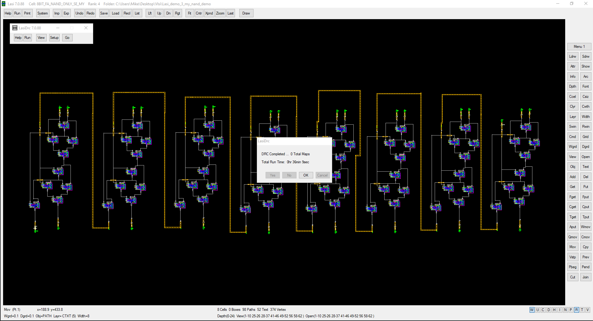
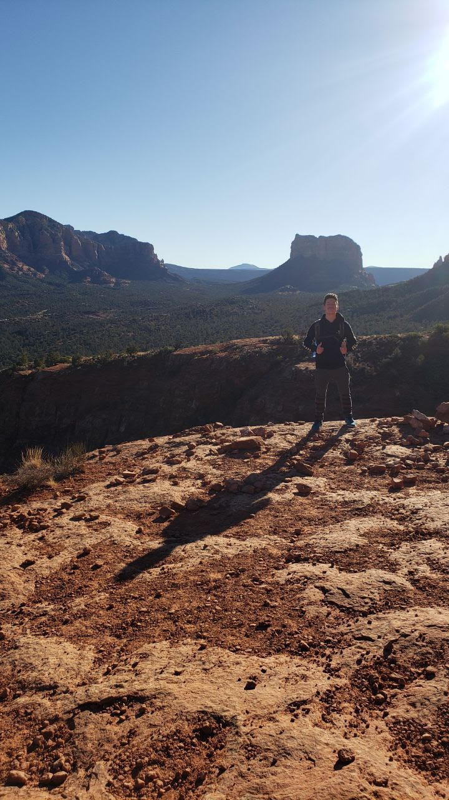

## About Me

I am a Computer Engineering student with strong foundation in a variety of programming languages as well as hardware design. I have knowledge in a variety of programming languages including:

* **Java**
* **C/C++**
* **JavaScript**
* **HTML**
* **SQL**
* **Python**

I also have experience in engineering related software such as:

* **SolidWorks**
* **Microsoft Office**
* **AutoCAD**
* **MATLAB**
* **Logisim**
* **Multisim**
* **LTspice**

When I am not tinkering with electronic DIY projects, I am often hiking with friends enjoying what nature has to offer.
## Mechatronics

**Purpose:**
<dd>Build and program an autonomous robot device to score as many points as possible in a 4-minute period by navigating a playfield while collecting and depositing object into designated bases. The designing of each part was done primarily in SolidWorks. The fabrication materials were lmitted to: Nylon Screws and Nuts, eighth inch thick acrylic (1ft x 2ft), and 3/32 inch thick acrylic. Hardware such as hobby servos, breadboards, electrical components, wires, motors, and battery packs were supplied as well, but not limitted. </dd>
 

[More Design Photos](./another-page-vc.html).
## Video Card
**Purpose:**
<dd>This video was implemented using a variety of circuit elements, including: binary counters, hex inverters, NAND gates, and a 10MHz oscillator. The card is designed to output a resolution of 800x600 pixels and with additional programming as well as an EPROM (electronic programmable read only memory) it is fully capable of displaying still pictures.</dd>
 

[More Photos](./another-page.html).

## 8-Bit Virtual Adder
**Purpose:**
<dd>The composed circuit was designed with LASI software and required multiple layers of circuitry to be created. THe circuit began at the most basic level, with the formation of p-wells and n-well, and was then connected to the upper levels with the use of via metals. The LASI software was able to automatically generate Verilog code, and after tinkering with parasitic capacitances and variable voltages, the circuit outputs were graphed in LTspice to confirm functionality.</dd>
 

[More Photos](./another-page-bit.html).

## Travel
**Purpose:**
<dd>
Look deep into nature, and then you will understand everything better. —Albert Einstein
</dd>
 

[More Photos](./another-page-travel.html).

