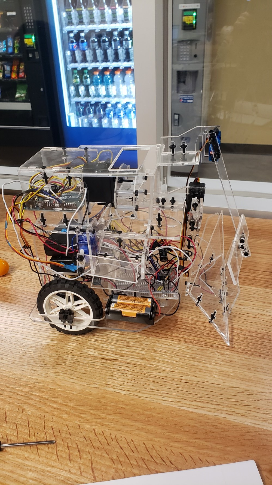
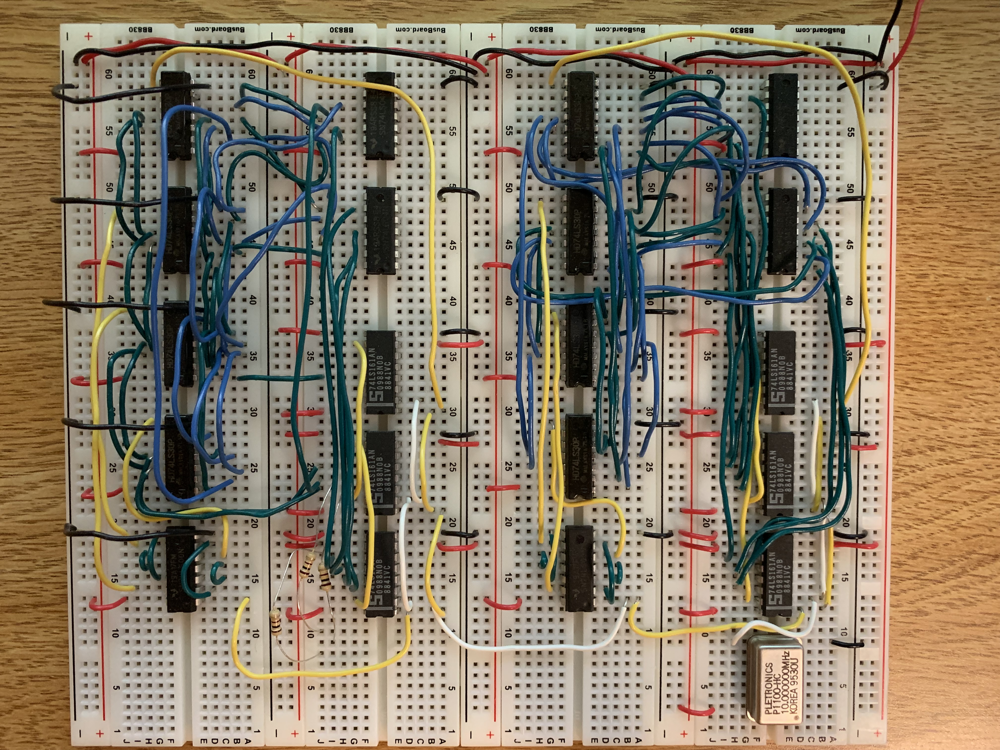

Text can be **bold**, _italic_, or ~~strikethrough~~.


## About Me

I am a Computer Engineering student with strong foundation in a variety of programming languages as well as hardware design. I have knowledge in a variety of programming languages including:

* **Java**
* **C/C++**
* **JavaScript**
* **HTML**
* **SQL**
* **Python**

I also have experience in engineering related software such as:

* **SolidWorks**
* **Microsoft Office**
* **AutoCAD**
* **MATLAB**
* **Logisim**
* **Multisim**
* **LTspice**

When I am not tinkering with electronic DIY projects, I am often hiking with friends enjoying what nature has to offer.
## Mechatronics

**Objective:**
<dd>Godzilla</dd>

<a href="/Mechatronics.html"></a>


[More Design Photos](./another-page-vc.html).
## Video Card
**Purpose:**
<dd>This video was implemented using a variety of circuit elements, including: binary counters, hex inverters, NAND gates, and a 10MHz oscillator. The card is designed to output a resolution of 800x600 pixels and with additional programming as well as an EPROM (electronic programmable read only memmory) it is fully capable of displaying still pictures.</dd>
<br>
<a href="/Mechatronics.html"></a>
[More Photos](./another-page.html).
##### Header 5

1.  This is an ordered list following a header.
2.  This is an ordered list following a header.
3.  This is an ordered list following a header.

###### Header 6

| head1        | head two          | three |
|:-------------|:------------------|:------|
| ok           | good swedish fish | nice  |
| out of stock | good and plenty   | nice  |
| ok           | good `oreos`      | hmm   |
| ok           | good `zoute` drop | yumm  |

### There's a horizontal rule below this.

* * *

### Here is an unordered list:

*   Item foo
*   Item bar
*   Item baz
*   Item zip

### And an ordered list:

1.  Item one
1.  Item two
1.  Item three
1.  Item four

### And a nested list:

- level 1 item
  - level 2 item
  - level 2 item
    - level 3 item
    - level 3 item
- level 1 item
  - level 2 item
  - level 2 item
  - level 2 item
- level 1 item
  - level 2 item
  - level 2 item
- level 1 item

### Small image


### Large image


### Definition lists can be used with HTML syntax.

<dl>
<dt>Name</dt>
<dd>Godzilla</dd>
<dt>Born</dt>
<dd>1952</dd>
<dt>Birthplace</dt>
<dd>Japan</dd>
<dt>Color</dt>
<dd>Green</dd>
</dl>

```
Long, single-line code blocks should not wrap. They should horizontally scroll if they are too long. This line should be long enough to demonstrate this.
```

```
The final element.
```
